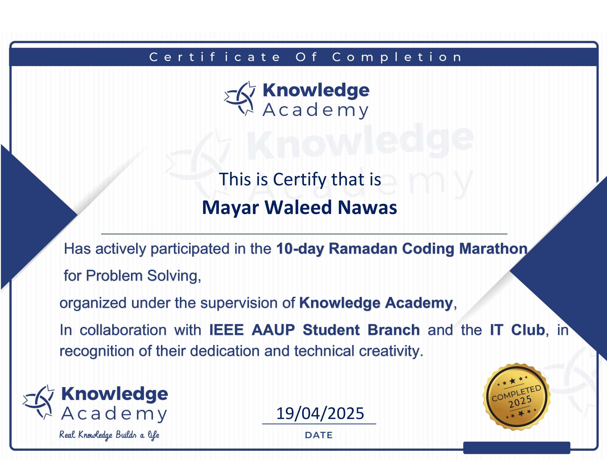

# 🌙 Ramadan Coding Marathon 2025 – Knowledge Academy & AAUP 🎉

This repository contains the Java solutions I submitted during the **10-day Ramadan Coding Marathon for Problem Solving**, organized by **Knowledge Academy** in collaboration with the **IEEE AAUP Student Branch** and the **IT Club** at the **Arab American University (AAUP)**.

I proudly achieved **Rank 17 out of 71 problems** in this intensive training experience! 🏆

---

## 🏁 Marathon Details:
- 📅 Event Duration: **10 Days**
- 🏫 Organizer: **Knowledge Academy**  
  in cooperation with **IEEE AAUP Student Branch** and the **IT Club**
- 🧑‍🎓 Participant: **Mayar Waleed Nawas**
- 💻 Language Used: **Java**
- 🔗 Contest Standings: [Codeforces Group Contest Standings](https://codeforces.com/group/xPZJQjcdFM/contest/597774/standings/groupmates/true)

---

## ✅ Problems Solved:

| #  | Problem Name                      | Verdict     |
|----|----------------------------------|-------------|
| 1  | Military Line-Up                 | Accepted ✅ |
| 2  | Feline Color Standardization     | Accepted ✅ |
| 3  | Cash Out Efficiently             | Accepted ✅ |
| 4  | Max Fib                          | Accepted ✅ |
| 5  | COVID-19                         | Accepted ✅ |
| 6  | Energy Grid Experiment           | Accepted ✅ |
| 7  | Sameer and the Factorial Board   | Accepted ✅ |
| 8  | Wall                              | Accepted ✅ |
| 9  | Quadratic Roots Story            | Accepted ✅ |
| 10 | HT Income                        | Accepted ✅ |
| 11 | hazem                            | Accepted ✅ |
| 12 | MaxMin Subarray                  | Accepted ✅ |
| 13 | Regexia's Scrolls                | Accepted ✅ |
| 14 | The Medal Distribution           | Accepted ✅ |
| 15 | Al-Khwarizmi                     | Accepted ✅ |

---

## 🎓 Certificate of Completion

🧾 I'm proud to have received this certificate for actively participating and solving problems in the Ramadan Coding Marathon.

📠

> 📌 Certificate issued by:  
> **Knowledge Academy**  
> In collaboration with **IEEE AAUP Student Branch** and **IT Club**  
> Dated: 19/04/2025

---

## 💻 Language Used
All problems were solved using **Java**.

---

## 📝 Reflections
> "Participating in this 10-day marathon during Ramadan helped me sharpen my problem-solving skills, think creatively under pressure, and practice disciplined daily coding. I’m excited to keep building on this experience in future contests and team-based challenges."

---

## 🤝 Let's Connect!
- 🌐 [Codeforces Profile – Mayar_Waleed](https://codeforces.com/profile/Mayar_Waleed)  
- 📂 Feel free to fork, explore, and give feedback on this repo!
